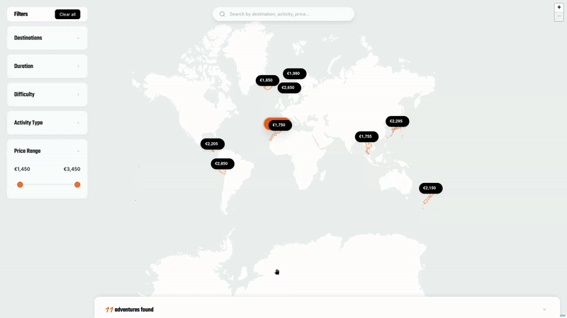

# 🗺️ Leaflet Adventure Map

[](https://www.typescriptlang.org/)
[](https://leafletjs.com/)
[](https://vitejs.dev/)
[](LICENSE)

Beautiful, minimal interactive map for exploring adventure travel destinations.



🤖 _This README was generated by AI._

## Features

- 🔍 Real-time search with dropdown suggestions
- 🗺️ Interactive map - click territories to filter destinations
- 💰 Dynamic price markers with sale badges
- ⚡ Smart filtering (destinations, duration, difficulty, price range)
- 📱 Fully responsive design

## Setup

```bash
# Install dependencies
bun install
# or: npm install
# or: pnpm install
# or: deno install

# Start development server
bun run dev
# or: npm run dev / pnpm dev / deno task dev

# Build for production
bun run build
# or: npm run build / pnpm build / deno task build
```

## Tech Stack

- TypeScript 5.9 (strict mode)
- Leaflet 1.9 for interactive maps
- Vite 7.1 for builds
- SCSS modules

## About

Originally created as a mockup for One Tribe's WordPress website, this project demonstrates clean TypeScript architecture with modular managers for filtering, search, maps, and UI. Built with performance in mind - debounced interactions, optimized builds (~471 KB total, ~102 KB gzip).

Designed for integration into WordPress plugins or as a standalone interactive map for travel platforms and adventure tourism sites.

## License

[MIT License](LICENSE) - Developed by [richardevcom](https://github.com/richardevcom)
